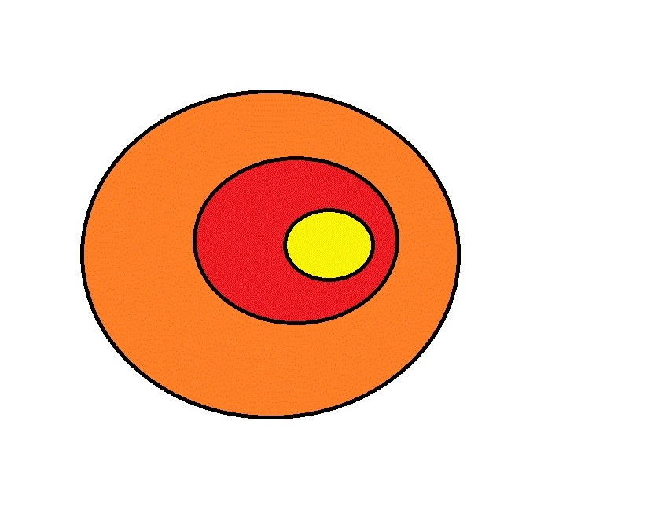

```{r setup, include=FALSE,echo=FALSE}
require(ggplot2)
library(ggiraph)
require(ggiraphExtra)
require(GGally)
require(ggExtra)
require(reshape2)
require(lme4)
library(dplyr)
library(car)
library(MASS)
library(ggeffects)
library(AED)
library(glmmML)## Koalas data
```

# spatial distribution

```{r load data, echo=TRUE}
Animals <- data(koalas)
```

## explaining data

Var name | Detail
---------|-------
pprim ssite |  Percentage of Primary trees in each sub-site 
psec ssite |  Percentage of Secondary trees in each sub-site
phss 1km | Percentage of the landscape within  1km  respectively, of each subsite that is highly suitable 
phss 2.5km | Percentage of the landscape within 2.5 KM , respectively, of each subsite that is highly suitable 
phss 5km | Percentage of the landscape within  5km, respectively, of each subsite that is highly suitable 
pm 1km | Percentage of the landscape within  1 KM  respectively, of each subsite that is marginal suitable 
pm 2.5km | Percentage of the landscape within  2.5 KM  respectively, of each subsite that is marginal suitable 
pm 5km | Percentage of the landscape within  5 KM  respectively, of each subsite that is marginal suitable 
pdens 1km | Density (patches/100 ha) of habitat at 1 KM
pdens 2.5km |Density (patches/100 ha) of habitat at 2.5 Km
pdens 5km | Density (patches/100 ha) of habitat
edens 1km | Density (m/ha) of habitat patch edges
edens 2.5km | Density (m/ha) of habitat patch edges
edens 5km | Density (m/ha) of habitat patch edges
rdens 1km | Density (m/ha) of paved roads 
rdens 2.5km | Density (m/ha) of paved roads 
rdens 5km | Density (m/ha) of paved roads 

# Data expolaration and discriptive

The can be two major issue

1. Col linearity and/or
2. Spatial auto correlation. 

## Collinear check 


```{r coll,echo=T}
cor(Koalas[,6:22],method = "spearman")
## An example of spatial colinear variable. 

ggpairs(Koalas[,8:10])
```

We can see that similar variable at different distance are show co-linear behavior.This suggest that our data is spatial nested. 

To overcome this variable we need to perform a calculation. This will divide out data such that new data will be 5 to 2.5 km, 2.5 to 1 KM


```{r tackle colinear,echo=TRUE}
Koalas <- Koalas%>%mutate(phss_2.5km_new = phss_2.5km- phss_5km,
                phss_1km_new = phss_1km-phss_2.5km,
                pm_2.5km_new = pm_2.5km - pm_5km,
                pm_1km_new = pm_1km - pm_2.5km,
                pdens_2.5km_new = pdens_2.5km - pdens_5km,
                pdens_1km_new = pdens_1km - pdens_2.5km,
                edens_2.5km_new = edens_2.5km - edens_5km,
                edens_1km_new = edens_1km - edens_2.5km,
                rdens_2.5km_new = rdens_2.5km - rdens_5km,
                rdens_1km_new = rdens_1km - rdens_5km)
ggpairs(Koalas[,c(8,23,24)])
```

We can also check if co-linearity is impacting the model by using package called car and function call VCF

```{r first model,echo=TRUE}
glm0 <- glm(presence~pprim_ssite+psec_ssite+
              phss_5km+phss_2.5km_new+phss_1km_new+
              pm_5km + pm_2.5km_new+pm_1km_new+
              pdens_5km+pdens_2.5km_new+pdens_1km_new+
              rdens_5km + rdens_2.5km_new +rdens_1km_new,
            data = Koalas, family = "binomial")

vif(glm0)
glm0.old <- glm(presence~pprim_ssite+psec_ssite+
              phss_5km+phss_2.5km+phss_1km+
              pm_5km + pm_2.5km+pm_1km+
              pdens_5km+pdens_2.5km+pdens_1km+
              rdens_5km + rdens_2.5km +rdens_1km,
            data = Koalas, family = "binomial")
vif(glm0.old)

glm0_2.5 <- glm(presence~pprim_ssite+psec_ssite+
              phss_2.5km_new+phss_1km_new+
              pm_2.5km_new+pm_1km_new+
              pdens_2.5km_new+pdens_1km_new+
             rdens_2.5km_new +rdens_1km_new,
            data = Koalas, family = "binomial")
vif(glm0_2.5)
glm0_1 <- glm(presence~pprim_ssite+psec_ssite+
              phss_1km_new+
              pm_1km_new+
              pdens_1km_new+
             rdens_1km_new,
            data = Koalas, family = "binomial")
vif(glm0_1)
## the value should be below 10, new study even less almost close to 1.5-2


```


We can also test for data for 2.5 km and 1 km to check how co-linearity behave. 

## spatial auto correaltion. 

```{r spatial autocorr,echo=TRUE}
library(ncf)
Correlog <- spline.correlog(x = Koalas[, "easting"],
y = Koalas[, "northing"],
z = Koalas[, "presence"], xmax = 10000)
plot(Correlog)
```


# Model selection 

```{r model selection, Koalas}
glm_sec <- glm(presence~.,
            data = Koalas[,c("presence","pprim_ssite","psec_ssite",
                             "phss_5km","phss_2.5km_new","phss_1km_new",
                             "pm_5km","pm_2.5km_new","pm_1km_new",
                             "pdens_5km","pdens_2.5km_new","pdens_1km_new",
                             "rdens_5km","rdens_2.5km_new","rdens_1km_new",
                             "edens_5km","edens_2.5km_new","edens_2.5km_new")]
            , family = "binomial")
Step_model <- stepAIC(glm_sec,trace = T,direction = "both")
Step_model
```


```{r, echo=FALSE}
library(glmmML)
glmmm_5km <- glmmML(presence~pprim_ssite+psec_ssite+
              phss_5km+phss_2.5km_new+phss_1km_new+
              pm_5km + pm_2.5km_new+pm_1km_new+
              pdens_5km+pdens_2.5km_new+pdens_1km_new+
              rdens_5km + rdens_2.5km_new +rdens_1km_new,
              cluster = site,
            data = Koalas, family = "binomial")

Corr_glmm5 <-spline.correlog(x = Koalas[, "easting"],
y = Koalas[, "northing"],
z = glmmm_5km$posterior.modes, xmax = 10000)
plot(Corr_glmm5)
```


```{r glm with best model, echo=TRUE}
Best_model <- glmer(formula = presence ~ pprim_ssite + phss_2.5km_new + pm_2.5km_new + 
    pm_1km_new + rdens_2.5km_new + edens_5km + (1|site), family = "binomial", data = Koalas)

Best_auto <- spline.correlog(x = Koalas[, "easting"],
y = Koalas[, "northing"],
z = residuals(Best_model), xmax = 10000)
plot(Best_auto)
summary(Best_model)
```


```{r plotting, echo=T}
pred_best <- ggpredict(Best_model,terms = "pprim_ssite",type = "re")
plot <- ggplot(data=pred_best,aes(x=x,y=predicted))
plot + geom_line() + 
  geom_ribbon(aes(ymin=predicted-std.error,ymax=predicted+std.error),alpha=0.2)+
  geom_jitter(data = Koalas,aes(x=pprim_ssite,y=presence))

```

